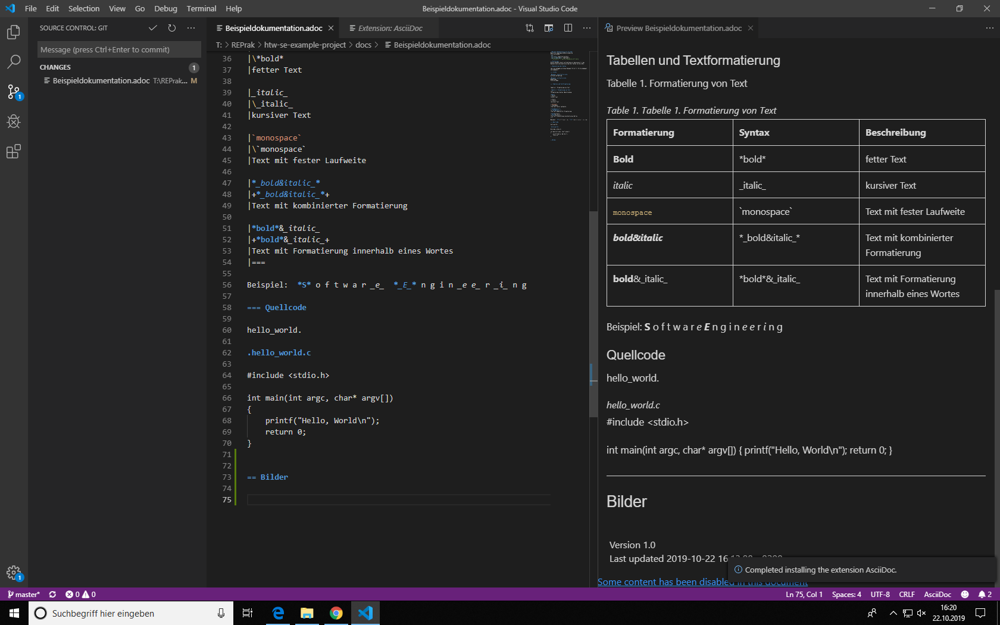

= Beispiel-Dokumentation mit AsciiDoc 
Banu Gürel banu.guerel@htw-dresden.de 
1.0, 22.10.2019 
:toc: 
:toc-title: Inhaltsverzeichnis
:source-highlighter: highlightjs
:xrefstyle: full | short | basic
// Platzhalter für weitere Dokumenten-Attribute 

== Einführung
Dieses Dokument dient im Praktikum als Spielwiese für das Kennenlernen und praktische Üben der Syntax von AsciiDoc.

== Kennenlernen der Syntax

Über die Aufgaben wird das Dokument Stück für Stück aufgebaut und angepasst.

=== Listen

.Beispiel: unsortierte Liste 
einfache Aufzählung

.Beispiel: sortierte Liste
Rangfolgen,
Platzierungen

=== Tabellen und Textformatierung

Tabelle 1. Formatierung von Text

.Tabelle 1. Formatierung von Text
|===
|Formatierung |Syntax |Beschreibung 

|*Bold*
|\*bold*
|fetter Text

|_italic_
|\_italic_
|kursiver Text

|`monospace`
|\`monospace`
|Text mit fester Laufweite

|*_bold&italic_*
|+*_bold&italic_*+
|Text mit kombinierter Formatierung 

|*bold*&_italic_
|+*bold*&_italic_+
|Text mit Formatierung innerhalb eines Wortes
|===

Beispiel:  *S* o f t w a r _e_  *_E_* n g i n _e e_ r _i_ n g

=== Quellcode

hello_world.

.hello_world.c

#include <stdio.h>

int main(int argc, char* argv[])
{
    printf("Hello, World\n");
    return 0;
}

=== Bilder

=== Verweise